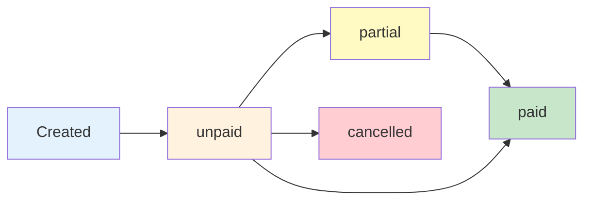

## Overview

The `ReceivableService` manages accounts receivable (CxC - Cuentas por Cobrar) for the ERP system. It handles the creation of receivables from credit sales, tracks payment status, and generates corresponding accounting journal entries.

**Namespace:** `App\Services\Accounting\Receivable\ReceivableService`

**Location:** `app/Services/Accounting/Receivable/ReceivableService.php`

## Dependencies

The service is constructed with:

- `JournalEntryService` - Creates accounting journal entries for receivables

---

## Methods

### createReceivable()

Creates a new accounts receivable record with corresponding accounting journal entry.

```php
public function createReceivable(array $data): Receivable
```

<ParamField path="data" type="array" required>
  Receivable data with the following structure:
  
  <Expandable title="data properties">
    <ParamField path="client_id" type="int" required>
      Client ID who owes the amount
    </ParamField>
    
    <ParamField path="total_amount" type="float" required>
      Total amount receivable
    </ParamField>
    
    <ParamField path="emission_date" type="string" required>
      Date the receivable was created (Carbon parseable format)
    </ParamField>
    
    <ParamField path="due_date" type="string" required>
      Payment due date (Carbon parseable format)
    </ParamField>
    
    <ParamField path="document_number" type="string" required>
      Document reference number (e.g., invoice number, sale number)
    </ParamField>
    
    <ParamField path="reference_type" type="string" required>
      Fully qualified class name of the related model (e.g., `App\Models\Sales\Sale`)
    </ParamField>
    
    <ParamField path="reference_id" type="int" required>
      ID of the related record (polymorphic relationship)
    </ParamField>
    
    <ParamField path="description" type="string" optional>
      Additional description. Defaults to "Registro CxC: {document_number} - Cliente: {client_name}"
    </ParamField>
    
    <ParamField path="accounting_account_id" type="int" optional>
      Specific accounts receivable account ID. Falls back to client's account or default 1.1.02
    </ParamField>
  </Expandable>
</ParamField>

<ResponseField name="return" type="Receivable">
  Returns the created Receivable model instance
</ResponseField>

**Process:**

1. **Retrieve Client** - Fetches client record
2. **Determine Account** - Uses (in priority order):
   - Client's specific accounting account (`client.accounting_account_id`)
   - Provided `accounting_account_id` from data
   - Default Accounts Receivable account (code 1.1.02)
3. **Create Journal Entry** - Creates posted entry:
   - Debit: Accounts Receivable Account (asset increase)
   - Credit: Income Account 4.1 (revenue recognition)
4. **Create Receivable Record** - Creates receivable with:
   - Initial status: `'unpaid'`
   - `current_balance` = `total_amount` (no payments yet)
   - Links to journal entry and client

**Important:** This method is typically invoked by `SaleService` for credit sales, not called directly from controllers.

#### Example Usage

```php
use App\Services\Accounting\Receivable\ReceivableService;
use App\Models\Sales\Sale;

public function __construct(
    protected ReceivableService $receivableService
) {}

// Creating receivable from a credit sale (typically done by SaleService)
public function createFromCreditSale($sale)
{
    $receivable = $this->receivableService->createReceivable([
        'client_id' => $sale->client_id,
        'total_amount' => $sale->total_amount,
        'emission_date' => $sale->sale_date,
        'due_date' => $sale->sale_date->copy()->addDays(30),
        'document_number' => $sale->number,
        'reference_type' => Sale::class,
        'reference_id' => $sale->id,
        'description' => "Venta a crédito registrada desde POS",
    ]);

    return $receivable;
}
```

```php
// Creating receivable with custom payment terms
public function createWithCustomTerms()
{
    $receivable = $this->receivableService->createReceivable([
        'client_id' => 5,
        'total_amount' => 2500.00,
        'emission_date' => now(),
        'due_date' => now()->addDays(60), // 60-day payment term
        'document_number' => 'FAC-2024-200',
        'reference_type' => 'App\\Models\\Sales\\Sale',
        'reference_id' => 123,
        'description' => 'Venta especial con términos extendidos',
    ]);

    return $receivable;
}
```

```php
// Creating receivable with client-specific account
public function createWithClientAccount()
{
    $client = Client::findOrFail(10);
    
    // If client has a specific receivables account assigned
    $receivable = $this->receivableService->createReceivable([
        'client_id' => $client->id,
        'total_amount' => 5000.00,
        'emission_date' => now(),
        'due_date' => now()->addDays(45),
        'document_number' => 'FAC-2024-201',
        'reference_type' => 'App\\Models\\Sales\\Sale',
        'reference_id' => 124,
        // accounting_account_id will use client's specific account
    ]);

    return $receivable;
}
```

---

### cancelReceivable()

Cancels an accounts receivable record. Only allowed if no payments have been applied.

```php
public function cancelReceivable(Receivable $receivable): bool
```

<ParamField path="receivable" type="Receivable" required>
  The Receivable model instance to cancel
</ParamField>

<ResponseField name="return" type="bool">
  Returns `true` if cancellation was successful
</ResponseField>

**Validation Rules:**
- Returns `true` immediately if already cancelled
- Throws exception if `current_balance < total_amount` (indicates payments exist)
- Only unpaid receivables (full balance remaining) can be cancelled

**Process:**

1. Check if already cancelled (return true if so)
2. Verify no payments applied (`current_balance === total_amount`)
3. Update status to `'cancelled'`
4. Set `current_balance` to 0

**Note:** This method updates the receivable status but does **not** create reversal accounting entries. That is handled by the calling service (e.g., `SaleService.cancel()`).

#### Example Usage

```php
use App\Models\Accounting\Receivable;

public function cancelInvoice($receivableId)
{
    $receivable = Receivable::findOrFail($receivableId);
    
    try {
        $result = $this->receivableService->cancelReceivable($receivable);
        
        if ($result) {
            return response()->json([
                'message' => 'Receivable cancelled successfully',
                'receivable_id' => $receivable->id,
                'document_number' => $receivable->document_number,
            ]);
        }
    } catch (\Exception $e) {
        return response()->json([
            'error' => $e->getMessage()
        ], 400);
    }
}
```

```php
// Example from SaleService cancellation flow
public function cancelCreditSale($saleId)
{
    $sale = Sale::findOrFail($saleId);
    
    if ($sale->payment_type === Sale::PAYMENT_CREDIT) {
        $receivable = Receivable::where('reference_type', Sale::class)
            ->where('reference_id', $sale->id)
            ->first();
        
        if ($receivable) {
            // This will throw exception if payments exist
            $this->receivableService->cancelReceivable($receivable);
        }
    }
    
    // Continue with sale cancellation...
}
```

---

### updateStatusBasedOnBalance()

Updates the receivable status based on its current balance. This method is **required** by `PaymentService` when processing payments.

```php
public function updateStatusBasedOnBalance(Receivable $receivable): void
```

<ParamField path="receivable" type="Receivable" required>
  The Receivable model instance to update
</ParamField>

**Status Logic:**

- `current_balance <= 0` → Status: `'paid'`
- `current_balance < total_amount` → Status: `'partial'`
- `current_balance >= total_amount` → Status: `'unpaid'`

**Usage Context:** This method should be called after any payment is applied to a receivable to keep the status synchronized with the balance.

#### Example Usage

```php
// Typically called by PaymentService after applying payment
public function applyPayment($receivableId, $paymentAmount)
{
    $receivable = Receivable::findOrFail($receivableId);
    
    // Reduce the balance
    $receivable->current_balance -= $paymentAmount;
    $receivable->save();
    
    // Update status based on new balance
    $this->receivableService->updateStatusBasedOnBalance($receivable);
    
    return $receivable->fresh();
}
```

```php
// Example showing full payment
public function processFullPayment($receivableId)
{
    $receivable = Receivable::findOrFail($receivableId);
    $amountDue = $receivable->current_balance;
    
    // Apply full payment
    $receivable->current_balance = 0;
    $receivable->save();
    
    // Update status (will become 'paid')
    $this->receivableService->updateStatusBasedOnBalance($receivable);
    
    // $receivable->status is now 'paid'
    return $receivable;
}
```

```php
// Example showing partial payment
public function processPartialPayment($receivableId, $paymentAmount)
{
    $receivable = Receivable::findOrFail($receivableId);
    
    if ($paymentAmount > $receivable->current_balance) {
        throw new \Exception('Payment exceeds balance due');
    }
    
    // Apply partial payment
    $receivable->current_balance -= $paymentAmount;
    $receivable->save();
    
    // Update status (will become 'partial')
    $this->receivableService->updateStatusBasedOnBalance($receivable);
    
    // $receivable->status is now 'partial'
    return $receivable;
}
```

---

## Protected Methods

### getAccountIdByCode()

Helper method to retrieve accounting account ID by account code.

```php
protected function getAccountIdByCode(string $code): int
```

<ParamField path="code" type="string" required>
  Accounting account code (e.g., '1.1.02', '4.1')
</ParamField>

<ResponseField name="return" type="int">
  Returns the accounting account ID, or throws exception if not found
</ResponseField>

**Source Code Reference:** `ReceivableService.php:103-106`

---

## Receivable Model Constants

```php
Receivable::STATUS_UNPAID    // 'unpaid'
Receivable::STATUS_PARTIAL   // 'partial'
Receivable::STATUS_PAID      // 'paid'
Receivable::STATUS_CANCELLED // 'cancelled'
```

---

## Accounting Integration

### Journal Entry for Receivable Creation

When a receivable is created, the service generates this accounting entry:

```php
// Entry format:
// DR: Accounts Receivable (1.1.02 or client-specific account)
// CR: Income Account (4.1)

[
    'entry_date' => $emission_date,
    'reference' => $document_number,
    'description' => "Registro CxC: {document_number} - Cliente: {client_name}",
    'status' => 'posted',
    'items' => [
        [
            'accounting_account_id' => $receivableAccountId,
            'debit' => $total_amount,
            'credit' => 0,
            'note' => 'Cargo de deuda',
        ],
        [
            'accounting_account_id' => $incomeAccountId, // 4.1
            'debit' => 0,
            'credit' => $total_amount,
            'note' => 'Contrapartida de ingreso',
        ],
    ],
]
```

---

## Exception Handling

<AccordionGroup>
  <Accordion title="Cannot Cancel with Payments">
    **Exception:** `"No se puede anular una factura con abonos."`
    
    **Cause:** Attempting to cancel a receivable that has received partial or full payment
    
    **Resolution:** 
    - Check `current_balance === total_amount` before attempting cancellation
    - If payments exist, use a different business process (credit notes, refunds, etc.)
    
    ```php
    if ($receivable->current_balance < $receivable->total_amount) {
        // Has payments - cannot cancel directly
        throw new Exception('Cannot cancel receivable with payments');
    }
    ```
  </Accordion>

  <Accordion title="Client Not Found">
    **Cause:** Invalid `client_id` provided to `createReceivable()`
    
    **Resolution:** Verify client exists before creating receivable
    
    ```php
    $client = Client::find($clientId);
    if (!$client) {
        throw new Exception('Client not found');
    }
    ```
  </Accordion>

  <Accordion title="Missing Account Configuration">
    **Cause:** Income Account (4.1) or default Receivable Account (1.1.02) not found
    
    **Resolution:** Ensure required accounting accounts are configured in the system
  </Accordion>
</AccordionGroup>

---

## Database Transaction Safety

Both `createReceivable()` and `cancelReceivable()` methods wrap operations in database transactions using `DB::transaction()`. This ensures:

- Journal entries and receivable records are created atomically
- Failures trigger complete rollback
- Data consistency is maintained

---

## Receivable Lifecycle



<Steps>
  <Step title="Creation">
    Receivable is created via `createReceivable()` with status `'unpaid'` and full balance
  </Step>
  
  <Step title="Payment Processing">
    As payments are applied:
    - Balance decreases
    - Status updates via `updateStatusBasedOnBalance()`
    - Transitions: unpaid → partial → paid
  </Step>
  
  <Step title="Completion or Cancellation">
    Either:
    - Fully paid (status: `'paid'`, balance: 0)
    - Cancelled (status: `'cancelled'`, balance: 0, no payments)
  </Step>
</Steps>

---

## Integration Points

### Used By

- **SaleService** - Creates receivables for credit sales, cancels receivables on sale cancellation
- **PaymentService** - Calls `updateStatusBasedOnBalance()` after applying payments
- **InvoiceController** - May create standalone receivables for invoicing

### Uses

- **JournalEntryService** - Creates accounting entries for receivable transactions
- **Client Model** - Retrieves client information and specific accounting accounts
- **AccountingAccount Model** - Retrieves receivable and income account IDs

---

## Related Models

- [Receivable Model](/api/models/receivable) - Receivable entity
- [Client Model](/api/models/client) - Client information
- [JournalEntry Model](/api/models/journal-entry) - Associated accounting entries
- [Payment Model](/api/models/payment) - Payment applications

---

## Best Practices

<CardGroup cols={2}>
  <Card title="Use Service Methods" icon="gears">
    Always use service methods rather than creating receivables directly to ensure accounting integrity
  </Card>
  
  <Card title="Check Balance Before Cancel" icon="shield-check">
    Verify `current_balance === total_amount` before attempting cancellation
  </Card>
  
  <Card title="Update Status After Payments" icon="rotate">
    Always call `updateStatusBasedOnBalance()` after modifying `current_balance`
  </Card>
  
  <Card title="Use References" icon="link">
    Always populate `reference_type` and `reference_id` to maintain audit trail to source documents
  </Card>
</CardGroup>