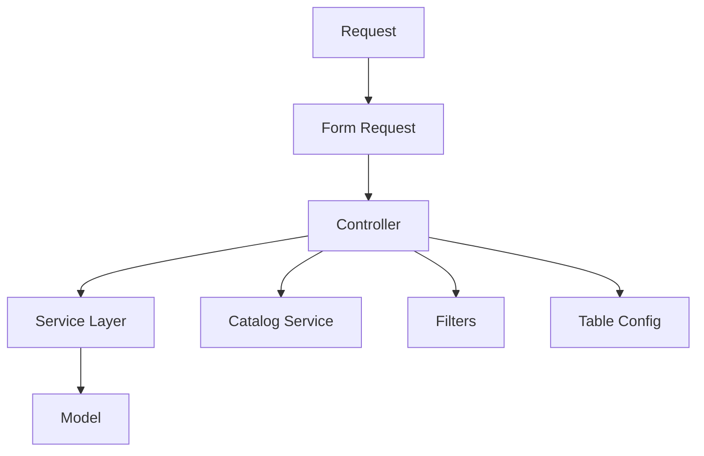

## Overview

This Laravel ERP system follows a layered architecture pattern designed to maintain **"Skinny Controllers"**, promote code reusability, and facilitate unit testing. Every module follows the same structure and implementation checklist.

<Tip>
  All modules follow the same pattern: Model → Table → Filters → Form Requests → Services → Controller. This consistency makes the codebase predictable and maintainable.
</Tip>

## Architecture Layers

The system is organized into 6 distinct layers, each with a specific responsibility:



### Layer Responsibilities

<CardGroup cols={2}>
  <Card title="Model Layer" icon="database">
    **Location:** `app/Models/[Module].php`
    
    Manages data persistence and relationships. Must define `scopeWithIndexRelations()` for eager loading.
  </Card>
  
  <Card title="Table Configuration" icon="table">
    **Location:** `app/Tables/[Module]Table.php`
    
    Centralizes column names and visibility logic for desktop/mobile views.
  </Card>
  
  <Card title="Filter Pipeline" icon="filter">
    **Location:** `app/Filters/[Module]/`
    
    Each filter is an independent class. Keeps controllers clean of WHERE clauses.
  </Card>
  
  <Card title="Form Requests" icon="shield-check">
    **Location:** `app/Http/Requests/[Module]/`
    
    Validates data and verifies Spatie permissions before controller execution.
  </Card>
  
  <Card title="Catalog Service" icon="list">
    **Location:** `app/Services/[Module]/[Module]CatalogService.php`
    
    Provides data for dropdowns and filters, filtered by country_id or other global parameters.
  </Card>
  
  <Card title="Business Service" icon="gear">
    **Location:** `app/Services/[Module]/[Module]Service.php`
    
    Executes write operations, complex calculations, and bulk actions. Handles DB transactions.
  </Card>
</CardGroup>

## Implementation Checklist

Use this checklist when creating a new module to ensure consistency:

<Steps>
  <Step title="Database & Security">
    <AccordionGroup>
      <Accordion title="Migration">
        Create and run migration with SoftDeletes:
        
        ```bash
        php artisan make:migration create_[modules]_table
        ```
        
        ```php app/database/migrations/xxxx_create_modules_table.php
        use Illuminate\Database\Migrations\Migration;
        use Illuminate\Database\Schema\Blueprint;
        use Illuminate\Support\Facades\Schema;
        
        return new class extends Migration
        {
            public function up(): void
            {
                Schema::create('modules', function (Blueprint $table) {
                    $table->id();
                    $table->string('name');
                    $table->boolean('is_active')->default(true);
                    $table->timestamps();
                    $table->softDeletes();
                });
            }
        
            public function down(): void
            {
                Schema::dropIfExists('modules');
            }
        };
        ```
      </Accordion>
      
      <Accordion title="Permissions Seeder">
        Create permission seeder following Spatie pattern:
        
        ```php database/seeders/PermissionSeeder/ModulePermissionsSeeder.php
        <?php
        
        namespace Database\Seeders\PermissionSeeder;
        
        use Illuminate\Database\Seeder;
        use Spatie\Permission\Models\Permission;
        
        class ModulePermissionsSeeder extends Seeder
        {
            public function run(): void
            {
                $permissions = [
                    'modules index',    // View list
                    'modules create',   // Create new
                    'modules edit',     // Edit records
                    'modules delete',   // Delete and purge
                    'modules restore',  // View trash and restore
                ];
        
                foreach ($permissions as $permission) {
                    Permission::firstOrCreate(['name' => $permission]);
                }
            }
        }
        ```
        
        Run the seeder:
        ```bash
        php artisan db:seed --class=ModulePermissionsSeeder
        ```
      </Accordion>
      
      <Accordion title="Model Configuration">
        Configure model with relationships and scope:
        
        ```php app/Models/Module.php
        <?php
        
        namespace App\Models;
        
        use Illuminate\Database\Eloquent\Model;
        use Illuminate\Database\Eloquent\SoftDeletes;
        use Illuminate\Database\Eloquent\Relations\BelongsTo;
        
        class Module extends Model
        {
            use SoftDeletes;
        
            protected $fillable = ['name', 'is_active'];
        
            protected $casts = [
                'is_active' => 'boolean',
            ];
        
            /**
             * Centralize eager loading for index and exports
             */
            public function scopeWithIndexRelations($query)
            {
                return $query->with([
                    'relatedModel:id,name',
                    // Add other frequently accessed relationships
                ]);
            }
        }
        ```
      </Accordion>
    </AccordionGroup>
  </Step>
  
  <Step title="Backend Logic">
    <AccordionGroup>
      <Accordion title="Table Configuration">
        ```php app/Tables/ModuleTable.php
        <?php
        
        namespace App\Tables;
        
        class ModuleTable
        {
            /**
             * All available columns with readable labels
             */
            public static function allColumns(): array
            {
                return [
                    'id'         => 'ID',
                    'name'       => 'Name',
                    'is_active'  => 'Status',
                    'created_at' => 'Created',
                    'updated_at' => 'Updated',
                ];
            }
        
            /**
             * Default visible columns on desktop
             */
            public static function defaultDesktop(): array
            {
                return ['id', 'name', 'is_active', 'created_at'];
            }
        
            /**
             * Critical columns for mobile view
             */
            public static function defaultMobile(): array
            {
                return ['name', 'is_active'];
            }
        }
        ```
      </Accordion>
      
      <Accordion title="Filter Pipeline">
        Create the main filter class:
        
        ```php app/Filters/Module/ModuleFilters.php
        <?php
        
        namespace App\Filters\Module;
        
        use App\Filters\Base\QueryFilter;
        
        class ModuleFilters extends QueryFilter
        {
            protected function filters(): array
            {
                return [
                    'search'    => ModuleSearchFilter::class,
                    'is_active' => ModuleStatusFilter::class,
                    'from_date' => ModuleDateFilter::class,
                ];
            }
        }
        ```
        
        Create individual filter classes:
        
        ```php app/Filters/Module/ModuleSearchFilter.php
        <?php
        
        namespace App\Filters\Module;
        
        use Illuminate\Database\Eloquent\Builder;
        use Illuminate\Http\Request;
        use App\Filters\Contracts\FilterInterface;
        
        class ModuleSearchFilter implements FilterInterface
        {
            public function __construct(protected Request $request) {}
        
            public function apply(Builder $query): Builder
            {
                $value = $this->request->input('search');
                if (!$value) return $query;
        
                return $query->where(function($q) use ($value) {
                    $q->where('name', 'like', "%{$value}%")
                      ->orWhere('code', 'like', "%{$value}%");
                });
            }
        }
        ```
      </Accordion>
    </AccordionGroup>
  </Step>
  
  <Step title="Services Layer">
    Implement Catalog and Business services:
    
    <Tip>
      Services are covered in detail in the [Catalog Services](/development/catalog-services) and [Business Services](/development/business-services) pages.
    </Tip>
  </Step>
  
  <Step title="HTTP Layer">
    <AccordionGroup>
      <Accordion title="Form Requests">
        See detailed documentation in [Form Requests](/development/form-requests).
      </Accordion>
      
      <Accordion title="Routes">
        Register routes in `routes/web.php`:
        
        ```php routes/web.php
        use App\Http\Controllers\ModuleController;
        
        Route::middleware(['auth'])->group(function () {
            // Standard CRUD routes
            Route::resource('modules', ModuleController::class);
            
            // Bulk actions
            Route::post('modules/bulk', [ModuleController::class, 'bulk'])
                ->name('modules.bulk');
            
            // Export
            Route::get('modules/export', [ModuleController::class, 'export'])
                ->name('modules.export');
            
            // Trash management
            Route::get('modules/eliminados', [ModuleController::class, 'eliminados'])
                ->name('modules.eliminados');
            Route::post('modules/{id}/restore', [ModuleController::class, 'restore'])
                ->name('modules.restore');
            Route::delete('modules/{id}/purge', [ModuleController::class, 'purge'])
                ->name('modules.purge');
        });
        ```
      </Accordion>
      
      <Accordion title="Controller">
        ```php app/Http/Controllers/ModuleController.php
        <?php
        
        namespace App\Http\Controllers;
        
        use App\Http\Requests\Module\{StoreModuleRequest, UpdateModuleRequest, BulkModuleRequest};
        use App\Models\Module;
        use App\Services\Module\{ModuleService, ModuleCatalogService};
        use App\Filters\Module\ModuleFilters;
        use App\Tables\ModuleTable;
        use Illuminate\Http\Request;
        
        class ModuleController extends Controller
        {
            public function __construct(
                protected ModuleService $service,
                protected ModuleCatalogService $catalogService
            ) {}
        
            /**
             * Display the module index with filters
             */
            public function index(Request $request)
            {
                $visibleColumns = $request->input('columns', ModuleTable::defaultDesktop());
                $perPage = $request->input('per_page', 10);
        
                // Apply filter pipeline
                $modules = (new ModuleFilters($request))
                    ->apply(Module::query()->withIndexRelations())
                    ->latest()
                    ->paginate($perPage)
                    ->withQueryString();
        
                $catalogs = $this->catalogService->getForFilters();
        
                if ($request->ajax()) {
                    return view('modules.partials.table', [
                        'items'          => $modules,
                        'visibleColumns' => $visibleColumns,
                        'allColumns'     => ModuleTable::allColumns(),
                    ])->render();
                }
        
                return view('modules.index', array_merge(
                    ['items' => $modules, 'visibleColumns' => $visibleColumns],
                    $catalogs
                ));
            }
        
            /**
             * Show the form for creating a new module
             */
            public function create()
            {
                return view('modules.create', $this->catalogService->getForForm());
            }
        
            /**
             * Store a new module
             */
            public function store(StoreModuleRequest $request)
            {
                $module = $this->service->create($request->validated());
        
                return redirect()
                    ->route('modules.index')
                    ->with('success', "Module {$module->name} created successfully.");
            }
        
            /**
             * Show the form for editing a module
             */
            public function edit(Module $module)
            {
                return view('modules.edit', array_merge(
                    ['module' => $module],
                    $this->catalogService->getForForm()
                ));
            }
        
            /**
             * Update the specified module
             */
            public function update(UpdateModuleRequest $request, Module $module)
            {
                $this->service->update($module, $request->validated());
        
                return redirect()
                    ->route('modules.index')
                    ->with('success', "Module {$module->name} updated successfully.");
            }
        
            /**
             * Soft delete a module
             */
            public function destroy(Module $module)
            {
                $module->delete();
        
                return redirect()
                    ->route('modules.index')
                    ->with('success', 'Module moved to trash.');
            }
        
            /**
             * Handle bulk actions
             */
            public function bulk(BulkModuleRequest $request)
            {
                $count = $this->service->performBulkAction(
                    $request->input('ids'),
                    $request->input('action'),
                    $request->input('value')
                );
        
                $label = $this->service->getActionLabel($request->input('action'));
        
                return back()->with('success', "{$count} modules {$label}.");
            }
        }
        ```
      </Accordion>
    </AccordionGroup>
  </Step>
  
  <Step title="Frontend Views">
    <Note>
      Frontend views should include:
      - Index view with AJAX table and filter components
      - JavaScript configuration for `window.filterSources` to render filter chips
      - Create/Edit forms populated by CatalogService data
    </Note>
  </Step>
</Steps>

## Standard Flow Example

Here's how a typical `store` operation flows through the architecture:

```php
/**
 * Store a new module
 * 
 * StoreModuleRequest handles:
 * 1. Permission authorization (authorize method)
 * 2. Data validation (rules method)
 */
public function store(StoreModuleRequest $request, ModuleService $service)
{
    // Service centralizes creation and database logic
    $module = $service->create($request->validated());

    return redirect()
        ->route('modules.index')
        ->with('success', "Module {$module->name} created successfully.");
}
```

## Key Principles

<CardGroup cols={2}>
  <Card title="Skinny Controllers" icon="feather">
    Controllers should only orchestrate. No business logic, no DB queries, no complex validations.
  </Card>
  
  <Card title="Single Responsibility" icon="bullseye">
    Each class does one thing well. Filters filter, Services contain business logic, Requests validate.
  </Card>
  
  <Card title="Consistency" icon="clone">
    Every module follows the same structure. Learn once, apply everywhere.
  </Card>
  
  <Card title="Testability" icon="vial">
    Services are easy to unit test. Filters can be tested independently.
  </Card>
</CardGroup>

## Real-World Example

Let's look at how the Sales module implements this pattern:

<CodeGroup>
```php app/Http/Controllers/Sales/SaleController.php
public function store(StoreSaleRequest $request)
{
    try {
        $sale = $this->service->create($request->validated());

        return redirect()
            ->route('sales.index')
            ->with('success', "Sale #{$sale->number} registered successfully.");
    } catch (Exception $e) {
        return back()->withInput()->with('error', "Error: " . $e->getMessage());
    }
}
```

```php app/Services/Sales/SalesServices/SaleService.php
public function create(array $data): Sale
{
    return DB::transaction(function () use ($data) {
        $docType = DocumentType::where('code', 'FAC')->firstOrFail();
        $saleNumber = $docType->getNextNumberFormatted();
        $docType->increment('current_number');

        $sale = Sale::create([
            'document_type_id' => $docType->id,
            'number'           => $saleNumber,
            'client_id'        => $data['client_id'],
            'warehouse_id'     => $data['warehouse_id'],
            'total_amount'     => $data['total_amount'],
            'status'           => Sale::STATUS_COMPLETED,
        ]);

        // Create sale items
        foreach ($data['items'] as $item) {
            $sale->items()->create($item);
            
            // Register inventory movement
            $this->inventoryService->register([...]);
        }

        // Generate accounting entries
        if ($sale->payment_type === Sale::PAYMENT_CASH) {
            $this->generateSaleAccountingEntry($sale);
        }

        return $sale;
    });
}
```

```php app/Http/Requests/Sales/StoreSaleRequest.php
public function authorize(): bool
{
    return $this->user()->can('create sales');
}

public function rules(): array
{
    return [
        'client_id'    => ['required', 'exists:clients,id'],
        'warehouse_id' => ['required', 'exists:warehouses,id'],
        'total_amount' => ['required', 'numeric', 'min:0'],
        'items'        => ['required', 'array', 'min:1'],
    ];
}
```
</CodeGroup>

## Next Steps

<CardGroup cols={2}>
  <Card title="Catalog Services" icon="list" href="/development/catalog-services">
    Learn how to provide data for dropdowns and filters
  </Card>
  
  <Card title="Business Services" icon="gear" href="/development/business-services">
    Implement business logic and complex operations
  </Card>
  
  <Card title="Form Requests" icon="shield-check" href="/development/form-requests">
    Master validation and authorization patterns
  </Card>
  
  <Card title="Architecture Guide" icon="book" href="/architecture/overview">
    Understand the complete system architecture
  </Card>
</CardGroup>