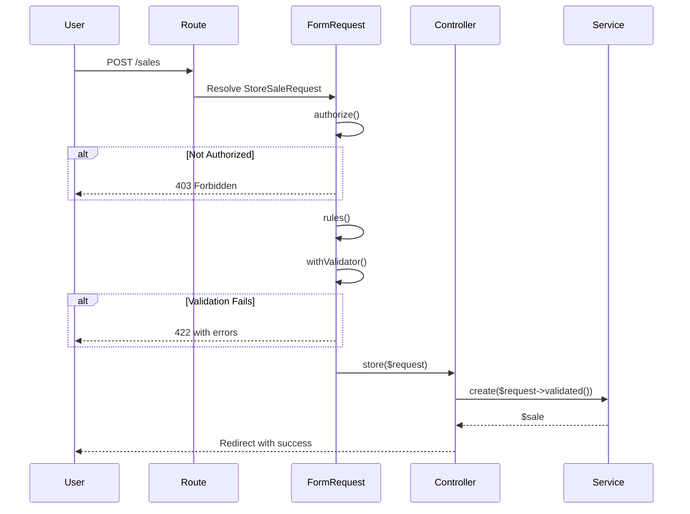

## Overview

Form Requests are Laravel classes that handle both **authorization** (permission checking) and **validation** (data rules) before any controller logic executes. This keeps controllers clean and centralizes security and validation logic.

<Tip>
  Form Requests act as the first line of defense. If authorization or validation fails, the controller code never runs.
</Tip>

## Naming Convention

Form Requests follow this pattern:

```
app/Http/Requests/[Module]/[Action][Module]Request.php
```

**Examples:**
- `app/Http/Requests/Sales/StoreSaleRequest.php`
- `app/Http/Requests/Sales/UpdateSaleRequest.php`
- `app/Http/Requests/Clients/BulkClientRequest.php`
- `app/Http/Requests/Products/StoreProductRequest.php`

## Standard Form Requests

Every module typically has three Form Request classes:

1. **Store[Module]Request** - For creating new records
2. **Update[Module]Request** - For editing existing records
3. **Bulk[Module]Request** - For bulk/batch operations

## Core Methods

Every Form Request must implement:

### authorize(): bool

Checks if the user has permission to perform the action using Spatie permissions.

### rules(): array

Defines validation rules for the incoming data.

### withValidator($validator) (optional)

Add custom validation logic after basic rules pass.

## Real-World Example: StoreSaleRequest

Let's examine the complete `StoreSaleRequest` from the Sales module:

```php app/Http/Requests/Sales/StoreSaleRequest.php
<?php

namespace App\Http\Requests\Sales;

use App\Models\Sales\Sale;
use App\Models\Inventory\InventoryStock;
use App\Models\Clients\Client;
use App\Models\Sales\Ncf\NcfType;
use Illuminate\Foundation\Http\FormRequest;
use Illuminate\Validation\Rule;

class StoreSaleRequest extends FormRequest
{
    /**
     * Check if user has permission to create sales
     */
    public function authorize(): bool
    {
        return $this->user()->can('create sales');
    }

    /**
     * Basic validation rules
     */
    public function rules(): array
    {
        return [
            'client_id'    => ['required', 'exists:clients,id'],
            'warehouse_id' => ['required', 'exists:warehouses,id'],
            'ncf_type_id'  => ['required', 'exists:ncf_types,id'],
            'sale_date'    => ['required', 'date', 'after_or_equal:today', 'before_or_equal:today'],
            'payment_type' => ['required', Rule::in([Sale::PAYMENT_CASH, Sale::PAYMENT_CREDIT])],
            
            // Conditional rule: required only for cash payments
            'tipo_pago_id' => [
                Rule::requiredIf($this->payment_type === Sale::PAYMENT_CASH), 
                'nullable', 
                'exists:tipo_pagos,id'
            ],
            
            'cash_received' => ['nullable', 'numeric', 'min:0'],
            'cash_change'   => ['nullable', 'numeric', 'min:0'],
            'total_amount'  => ['required', 'numeric', 'min:0'],
            'apply_tax'     => ['nullable', 'boolean'],
            'notes'         => ['nullable', 'string', 'max:255'],

            // Array validation for items
            'items'              => ['required', 'array', 'min:1'],
            'items.*.product_id' => ['required', 'exists:products,id'],
            'items.*.quantity'   => ['required', 'numeric', 'min:0.01'],
            'items.*.price'      => ['required', 'numeric', 'min:0'],
        ];
    }

    /**
     * Complex validation logic
     */
    public function withValidator($validator)
    {
        $validator->after(function ($validator) {
            // Skip if basic validation already failed
            if ($validator->errors()->any()) return;

            // 1. Load required data once
            $client = Client::with('estadoCliente.categoria')->find($this->client_id);
            $ncfType = NcfType::find($this->ncf_type_id);

            // --- NCF vs CLIENT VALIDATION ---
            if ($ncfType && $client) {
                // Credit Fiscal (B01 / E31) requires RNC (tax_id)
                if (in_array($ncfType->code, ['01', '31']) && empty($client->tax_id)) {
                    $validator->errors()->add(
                        'ncf_type_id', 
                        "NCF type {$ncfType->name} requires client to have RNC registered."
                    );
                }
            }

            // --- PAYMENT TYPE VALIDATION ---
            if ($this->payment_type === Sale::PAYMENT_CASH && empty($this->tipo_pago_id)) {
                $validator->errors()->add(
                    'tipo_pago_id', 
                    'Must select a payment method for cash sales.'
                );
            }

            // --- STOCK VALIDATION ---
            $subtotalCalculated = 0;
            foreach ($this->items as $index => $item) {
                $subtotalCalculated += ($item['quantity'] * $item['price']);

                $stock = InventoryStock::where('warehouse_id', $this->warehouse_id)
                    ->where('product_id', $item['product_id'])
                    ->first();

                if (!$stock || $stock->quantity < $item['quantity']) {
                    $available = $stock ? $stock->quantity : 0;
                    $validator->errors()->add(
                        "items.{$index}.quantity", 
                        "Insufficient stock. Available: {$available}."
                    );
                }
            }

            // --- TOTAL AND TAX VALIDATION ---
            $totalFinal = $subtotalCalculated;
            if ($this->boolean('apply_tax')) {
                $taxRate = general_config()->impuesto->valor ?? 0;
                $taxAmount = $subtotalCalculated * ($taxRate / 100);
                $totalFinal = $subtotalCalculated + $taxAmount;
            }

            if (abs($totalFinal - $this->total_amount) > 0.01) {
                $validator->errors()->add(
                    'total_amount', 
                    'Total does not match sum of products + taxes.'
                );
            }
            
            // --- CASH VALIDATION ---
            if ($this->payment_type === Sale::PAYMENT_CASH) {
                $received = (float) $this->cash_received;
                $total = (float) $this->total_amount;

                if ($received < $total) {
                    $validator->errors()->add(
                        'cash_received', 
                        'Cash received is less than total amount.'
                    );
                }
            }

            // --- CREDIT LOGIC ---
            if ($this->payment_type === Sale::PAYMENT_CREDIT && $client) {
                // Consumidor Final cannot use credit
                if ($client->id == 1 || $client->name === 'Consumidor Final') {
                    $validator->errors()->add(
                        'payment_type', 
                        'Consumidor Final cannot process credit sales.'
                    );
                }

                // Check client status
                $categoryCode = $client->estadoCliente->category->code ?? null;
                if (in_array($categoryCode, ['BLOQUEO_TOTAL', 'FINANCIERO_RESTRICTO'])) {
                    $validator->errors()->add(
                        'client_id', 
                        "Credit denied: Client status is {$client->estadoCliente->nombre}."
                    );
                }

                // Check credit limit
                $newProjectedBalance = $client->balance + $this->total_amount;
                if ($newProjectedBalance > $client->credit_limit) {
                    $available = number_format($client->credit_limit - $client->balance, 2);
                    $validator->errors()->add(
                        'total_amount', 
                        "Credit limit exceeded. Available: \${$available}."
                    );
                }
            }
        });
    }
}
```

## Key Validation Patterns

### 1. Permission Authorization

Use Spatie permissions to control access:

```php
public function authorize(): bool
{
    return $this->user()->can('create sales');
}
```

**Common permissions:**
- `'create [module]'` - For Store requests
- `'edit [module]'` - For Update requests
- `'delete [module]'` - For Destroy requests

### 2. Conditional Validation

Make fields required based on other field values:

```php
use Illuminate\Validation\Rule;

public function rules(): array
{
    return [
        'payment_type' => ['required', Rule::in(['cash', 'credit'])],
        
        // Only required when payment_type is 'cash'
        'tipo_pago_id' => [
            Rule::requiredIf($this->payment_type === 'cash'),
            'nullable',
            'exists:tipo_pagos,id'
        ],
    ];
}
```

### 3. Array Validation

Validate array items (like sale items):

```php
public function rules(): array
{
    return [
        'items'              => ['required', 'array', 'min:1'],
        'items.*.product_id' => ['required', 'exists:products,id'],
        'items.*.quantity'   => ['required', 'numeric', 'min:0.01'],
        'items.*.price'      => ['required', 'numeric', 'min:0'],
    ];
}
```

### 4. Complex Business Logic

Use `withValidator()` for complex validations:

```php
public function withValidator($validator)
{
    $validator->after(function ($validator) {
        // Skip if basic validation failed
        if ($validator->errors()->any()) return;

        // Load related data
        $client = Client::find($this->client_id);

        // Business rule validation
        if ($client->balance > $client->credit_limit) {
            $validator->errors()->add(
                'client_id',
                'Client has exceeded credit limit.'
            );
        }
    });
}
```

### 5. Database Validation

Validate against database state:

```php
public function withValidator($validator)
{
    $validator->after(function ($validator) {
        foreach ($this->items as $index => $item) {
            // Check stock availability
            $stock = InventoryStock::where('warehouse_id', $this->warehouse_id)
                ->where('product_id', $item['product_id'])
                ->first();

            if (!$stock || $stock->quantity < $item['quantity']) {
                $available = $stock ? $stock->quantity : 0;
                $validator->errors()->add(
                    "items.{$index}.quantity",
                    "Insufficient stock. Available: {$available}"
                );
            }
        }
    });
}
```

## Bulk Request Example

Bulk requests validate multiple IDs and actions:

```php app/Http/Requests/Clients/BulkClientRequest.php
<?php

namespace App\Http\Requests\Clients;

use Illuminate\Foundation\Http\FormRequest;

class BulkClientRequest extends FormRequest
{
    public function authorize(): bool
    {
        return $this->user()->can('edit clients');
    }

    public function rules(): array
    {
        return [
            'ids'    => 'required|array',
            'ids.*'  => 'exists:clients,id',
            'action' => 'required|in:delete,change_status,change_geo_state,reset_credit',
            'value'  => 'nullable'
        ];
    }

    public function messages(): array
    {
        return [
            'ids.required'    => 'Must select at least one client.',
            'action.required' => 'Bulk action is required.',
            'action.in'       => 'Selected action is not valid.',
        ];
    }
}
```

## Simple Request Example

For simpler modules with less validation:

```php app/Http/Requests/Products/BulkProductRequest.php
<?php

namespace App\Http\Requests\Products;

use Illuminate\Foundation\Http\FormRequest;

class BulkProductRequest extends FormRequest
{
    public function authorize(): bool
    {
        return $this->user()->can('edit products');
    }

    public function rules(): array
    {
        return [
            'ids'    => 'required|array',
            'ids.*'  => 'exists:products,id',
            'action' => 'required|in:change_active,change_stockable,change_category,change_unit',
            'value'  => 'nullable'
        ];
    }
}
```

## Controller Integration

Form Requests are type-hinted in controller methods:

```php app/Http/Controllers/Sales/SaleController.php
use App\Http\Requests\Sales\{StoreSaleRequest, UpdateSaleRequest};

class SaleController extends Controller
{
    /**
     * Authorization and validation happen automatically
     * Controller only runs if both pass
     */
    public function store(StoreSaleRequest $request)
    {
        // $request->validated() contains only validated data
        $sale = $this->service->create($request->validated());

        return redirect()
            ->route('sales.index')
            ->with('success', "Sale #{$sale->number} created.");
    }

    public function update(UpdateSaleRequest $request, Sale $sale)
    {
        $this->service->update($sale, $request->validated());

        return redirect()
            ->route('sales.index')
            ->with('success', "Sale updated.");
    }
}
```

## Custom Error Messages

Provide user-friendly error messages:

```php
public function messages(): array
{
    return [
        'client_id.required' => 'Please select a client.',
        'client_id.exists'   => 'Selected client does not exist.',
        'items.required'     => 'At least one product is required.',
        'items.min'          => 'At least one product is required.',
        'payment_type.in'    => 'Invalid payment type selected.',
    ];
}
```

## Custom Attribute Names

Make error messages more readable:

```php
public function attributes(): array
{
    return [
        'client_id'    => 'client',
        'warehouse_id' => 'warehouse',
        'total_amount' => 'total',
        'tipo_pago_id' => 'payment method',
    ];
}
```

Now errors read: "The **client** field is required" instead of "The **client_id** field is required".

## Request Template

Use this template for new Form Requests:

```php app/Http/Requests/[Module]/Store[Module]Request.php
<?php

namespace App\Http\Requests\Module;

use Illuminate\Foundation\Http\FormRequest;
use Illuminate\Validation\Rule;

class StoreModuleRequest extends FormRequest
{
    /**
     * Check if user has permission
     */
    public function authorize(): bool
    {
        return $this->user()->can('create modules');
    }

    /**
     * Basic validation rules
     */
    public function rules(): array
    {
        return [
            'name'      => ['required', 'string', 'max:255'],
            'is_active' => ['boolean'],
            'category'  => ['required', 'exists:categories,id'],
        ];
    }

    /**
     * Complex validation logic (optional)
     */
    public function withValidator($validator)
    {
        $validator->after(function ($validator) {
            if ($validator->errors()->any()) return;

            // Add custom validation logic here
        });
    }

    /**
     * Custom error messages (optional)
     */
    public function messages(): array
    {
        return [
            'name.required' => 'Module name is required.',
            'category.exists' => 'Selected category does not exist.',
        ];
    }

    /**
     * Custom attribute names (optional)
     */
    public function attributes(): array
    {
        return [
            'is_active' => 'status',
        ];
    }
}
```

## Validation Flow

Here's how validation flows through the system:



## Testing Form Requests

Form Requests can be tested independently:

```php tests/Unit/Requests/StoreSaleRequestTest.php
use App\Http\Requests\Sales\StoreSaleRequest;
use App\Models\User;
use Tests\TestCase;
use Illuminate\Foundation\Testing\RefreshDatabase;

class StoreSaleRequestTest extends TestCase
{
    use RefreshDatabase;

    public function test_authorization_passes_with_permission()
    {
        $user = User::factory()->create();
        $user->givePermissionTo('create sales');

        $request = new StoreSaleRequest();
        $request->setUserResolver(fn() => $user);

        $this->assertTrue($request->authorize());
    }

    public function test_authorization_fails_without_permission()
    {
        $user = User::factory()->create();

        $request = new StoreSaleRequest();
        $request->setUserResolver(fn() => $user);

        $this->assertFalse($request->authorize());
    }

    public function test_validation_requires_client_id()
    {
        $validator = Validator::make([], (new StoreSaleRequest())->rules());

        $this->assertTrue($validator->fails());
        $this->assertArrayHasKey('client_id', $validator->errors()->toArray());
    }
}
```

## Best Practices

<CardGroup cols={2}>
  <Card title="Use Spatie Permissions" icon="key">
    Always check permissions in the `authorize()` method using Spatie's `can()` method.
  </Card>
  
  <Card title="Keep Rules Simple" icon="list-check">
    Basic validation in `rules()`, complex business logic in `withValidator()`.
  </Card>
  
  <Card title="Early Return" icon="forward">
    In `withValidator()`, return early if basic validation already failed.
  </Card>
  
  <Card title="Clear Error Messages" icon="message">
    Provide user-friendly, actionable error messages in `messages()`.
  </Card>
</CardGroup>

## Common Validation Rules

<AccordionGroup>
  <Accordion title="Existence Rules">
    ```php
    'client_id'  => 'exists:clients,id',
    'product_id' => 'exists:products,id',
    ```
  </Accordion>
  
  <Accordion title="Conditional Rules">
    ```php
    'field' => Rule::requiredIf($this->other_field === 'value'),
    'field' => Rule::prohibitedIf($this->other_field === 'value'),
    ```
  </Accordion>
  
  <Accordion title="Numeric Rules">
    ```php
    'amount'   => 'numeric|min:0|max:99999.99',
    'quantity' => 'integer|min:1',
    'price'    => 'decimal:2|min:0',
    ```
  </Accordion>
  
  <Accordion title="String Rules">
    ```php
    'name'  => 'string|max:255',
    'email' => 'email|max:255',
    'code'  => 'alpha_num|size:10',
    ```
  </Accordion>
  
  <Accordion title="Date Rules">
    ```php
    'date' => 'date|after:today',
    'date' => 'date|before_or_equal:today',
    'date' => 'date|after_or_equal:' . $this->start_date,
    ```
  </Accordion>
  
  <Accordion title="Array Rules">
    ```php
    'items'            => 'required|array|min:1',
    'items.*.id'       => 'required|exists:products,id',
    'items.*.quantity' => 'required|numeric|min:0.01',
    ```
  </Accordion>
</AccordionGroup>

## Common Pitfalls

<Warning>
  **Avoid these mistakes:**
  
  1. **Missing authorization** - Always implement `authorize()` with proper permission checks
  2. **Validation in controllers** - Keep all validation in Form Requests
  3. **Not using validated()** - Always use `$request->validated()` to get clean data
  4. **Complex logic in rules()** - Move complex validation to `withValidator()`
  5. **Poor error messages** - Provide clear, actionable messages
  6. **N+1 in validation** - Be mindful of queries in `withValidator()`
</Warning>

## Next Steps

<CardGroup cols={2}>
  <Card title="Business Services" icon="gear" href="/development/business-services">
    Learn how services process validated data
  </Card>
  
  <Card title="Catalog Services" icon="list" href="/development/catalog-services">
    Provide data for form dropdowns
  </Card>
  
  <Card title="Testing" icon="vial" href="/testing/requests">
    Write tests for Form Requests
  </Card>
  
  <Card title="Adding Modules" icon="cube-plus" href="/development/adding-modules">
    Complete module implementation guide
  </Card>
</CardGroup>